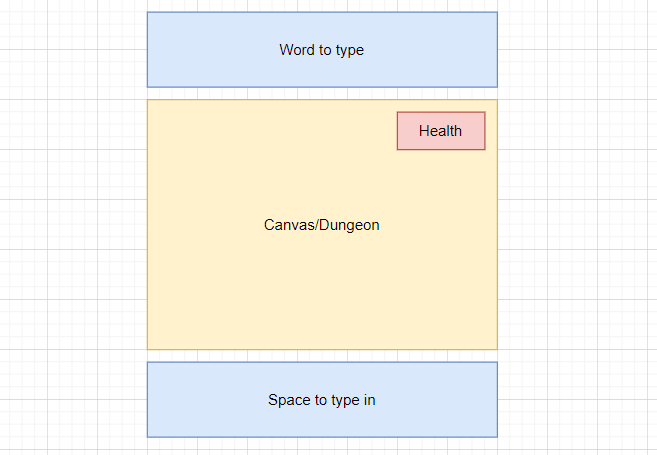

### Read Me Test

Game Idea:

A dungeon crawler/typing test crossover. You play a Spell Checker mage trapped in an essay dungeon, consisting
of small (Canvas-sized, even) rooms chained together into a larger dungeon. Each room is locked with a "typo door,"
a door associated with a word (Like "razzmatazz," as ane example). The player has to type the word correctly to unlock the door,
proceeding to the next room. If they incorrectly type the word three times, they lose. Typing is through keyboard, player movement
is through the arrow pad.

### Tech Stack

- [ ] HTML
- [ ] CSS
- [ ] Javascript
- [ ] Canvas

### Wireframe

### MVP Goals

- [ ] 3 room dungeon
- [ ] Doors to type on and move between rooms
- [x] Form submission, to accept string input from player
- [x] Compare player input to correct input
- [ ] 3-point Health bar (Detract from if player input is incorrect)

### Stretch Goals

- [ ] Writing word-to-type directly on the canvas, instead of above
- [ ] Enemies, whose names you have to type to defeat
- [ ] Locked chests containing health
- [ ] Shift-to-shield, allowing you to use SHIFT as a shield against attacks
- [ ] Custom graphics
- [ ] Super-stretch: Non-linear dungeon with rooms containing multiple entrances/exits
- [ ] Super-stretch: Enemy/door types that require special words found elsewhere in the dungeon

### Roadblocks

- [ ] Is it possible to elegantly accept input from inside and outside the canvas?
If not, is it possible to implement the typing mechanic in Canvas?
Will the game be fun and easy to play? Is it too tiresome to split play between typing and typical dungeon crawl?

- [ ] How to handle the dungeon. Would it be possible to hold all the rooms in an array of objects? Would a new room need to be generated each time? Is it possible to 
have retain memory of past rooms and keep a consistent layout between them?
